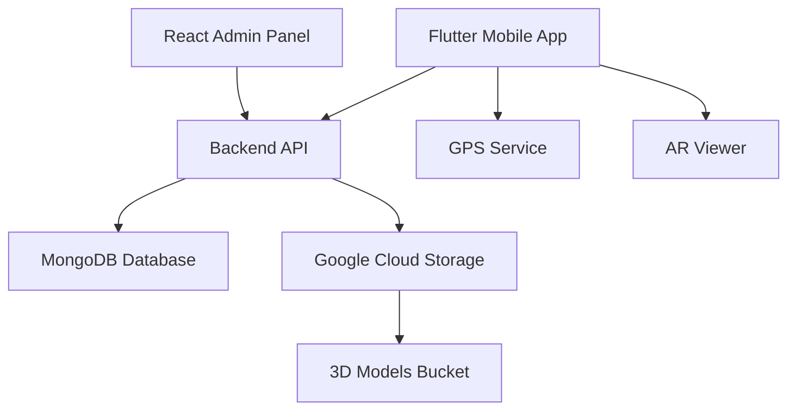

# Design Document

## Overview

This design document outlines the technical implementation for enhancing the HistoriAR platform with Google Cloud Storage integration, ARCore-based AR functionality, and advanced search capabilities. The solution involves completely replacing Cloudinary with Google Cloud Storage for all media management, implementing precise location-based AR activation (10-meter range), and providing comprehensive filtering for the Flutter mobile application with MongoDB Atlas as the database.

## Architecture

### System Components



### Technology Stack

- **Backend**: Node.js + Express + MongoDB Atlas
- **Admin Panel**: React + Vite + Tailwind CSS
- **Mobile App**: Flutter + ARCore
- **Storage**: Google Cloud Storage (histori_ar bucket) - replaces Cloudinary completely
- **Authentication**: JWT + Google Cloud Service Account
- **3D Rendering**: model-viewer (web) + ARCore (Flutter)

## Components and Interfaces

### 1. Complete Cloudinary to Google Cloud Storage Migration

#### Migration Strategy
- **Remove all Cloudinary dependencies**: cloudinary, multer-storage-cloudinary packages
- **Replace all Cloudinary URLs**: Update existing Monument and HistoricalData records
- **Migrate existing files**: Transfer current images/models from Cloudinary to GCS
- **Update upload endpoints**: All media uploads now go to GCS bucket "histori_ar"

#### File Organization in GCS
```
histori_ar/
├── models/          # 3D models (.glb, .gltf)
└── images/          # Monument images
```

### 2. Google Cloud Storage Integration

#### Backend Service Layer
```javascript
// services/gcsService.js
class GCSService {
  constructor() {
    this.bucket = storage.bucket('histori_ar');
    this.projectId = 'gen-lang-client-0583857862';
  }
  
  async uploadModel(file, monumentId) {
    // Upload 3D model to /models/ directory
    // Return public URL
  }
  
  async deleteModel(filename) {
    // Remove model from storage
  }
}
```

#### Upload Middleware
```javascript
// middlewares/uploadMiddleware.js
const multer = require('multer');
const { GCSService } = require('../services/gcsService');

const upload = multer({
  storage: multer.memoryStorage(),
  limits: { fileSize: 50 * 1024 * 1024 }, // 50MB
  fileFilter: (req, file, cb) => {
    // Validate GLB/GLTF files
  }
});
```

### 2. GPS-Based AR System

#### Flutter GPS Service
```dart
// services/gps_service.dart
class GPSService {
  static const double PROXIMITY_THRESHOLD = 10.0; // meters - maximum distance for AR
  
  Future<Position> getCurrentLocation();
  double calculateDistance(double lat1, double lon1, double lat2, double lon2);
  bool isWithinRange(Position userPos, Monument monument);
}
```

#### ARCore Integration
```dart
// screens/ar_viewer_screen.dart
class ARViewerScreen extends StatefulWidget {
  Future<void> validateProximity() {
    // Check GPS permissions
    // Get current location
    // Calculate distance to monument (max 10 meters)
    // Initialize ARCore session if within range
    // Load 3D model from GCS URL
    // Render model in AR space
  }
}

// services/arcore_service.dart
class ARCoreService {
  Future<void> initializeARSession();
  Future<void> loadModelFromGCS(String gcsUrl);
  void placeModelInAR(ARNode model);
}
```

### 3. Advanced Search and Filtering

#### Backend Search API
```javascript
// controllers/monumentController.js
async function searchMonuments(req, res) {
  const { text, district, category, institution } = req.query;
  
  const query = {};
  if (text) {
    query.$or = [
      { name: { $regex: text, $options: 'i' } },
      { description: { $regex: text, $options: 'i' } }
    ];
  }
  if (district) query['location.district'] = district;
  if (category) query.category = category;
  if (institution) query.institutionId = institution;
  
  // Execute search with pagination
}
```

#### Flutter Filter Interface
```dart
// widgets/monument_filter.dart
class MonumentFilter extends StatefulWidget {
  final Function(FilterCriteria) onFilterChanged;
  
  // District dropdown
  // Category chips
  // Institution selector
  // Text search field
}
```

## Data Models

### Updated Monument Schema
```javascript
// models/Monument.js
const MonumentSchema = new mongoose.Schema({
  name: { type: String, required: true, index: true },
  description: { type: String, index: 'text' },
  category: { 
    type: String, 
    enum: ['Arqueológico', 'Colonial', 'Republicano', 'Contemporáneo'],
    index: true 
  },
  location: {
    lat: { type: Number, required: true },
    lng: { type: Number, required: true },
    address: { type: String },
    district: { type: String, index: true }
  },
  imageUrl: { type: String }, // GCS URL for monument images
  model3DUrl: { type: String }, // GCS URL for 3D models
  gcsFileName: { type: String }, // For deletion purposes
  institutionId: { type: mongoose.Schema.Types.ObjectId, ref: 'Institution', index: true }
});

// Add text index for search
MonumentSchema.index({ name: 'text', description: 'text' });
```

### Filter Criteria Model (Flutter)
```dart
// models/filter_criteria.dart
class FilterCriteria {
  final String? searchText;
  final String? district;
  final String? category;
  final String? institutionId;
  
  Map<String, dynamic> toQueryParams();
}
```

## Error Handling

### GPS and ARCore Error Scenarios
1. **Permission Denied**: Show permission request dialog
2. **GPS Disabled**: Prompt user to enable location services
3. **Low Accuracy**: Display accuracy warning, require better GPS signal
4. **Distance > 10m**: Show "Get closer to monument" message, disable AR
5. **ARCore Not Supported**: Fallback to 2D model viewer
6. **ARCore Session Failed**: Retry mechanism with error feedback

### File Upload Error Handling
1. **File Size Exceeded**: Clear error message with size limit
2. **Invalid Format**: List supported formats (GLB, GLTF)
3. **Network Error**: Retry mechanism with progress indicator
4. **GCS Authentication**: Service account validation

### Search Error Handling
1. **Network Timeout**: Cached results fallback
2. **Invalid Filters**: Input validation and sanitization
3. **No Results**: Helpful suggestions and filter reset option

## Testing Strategy

### Backend Testing
- **Unit Tests**: GCS service methods, search algorithms
- **Integration Tests**: File upload flow, search API endpoints
- **Load Tests**: Multiple concurrent uploads, search performance

### Flutter Testing
- **Widget Tests**: Filter components, search interface
- **Integration Tests**: GPS flow, ARCore initialization, AR activation logic
- **Platform Tests**: Android ARCore compatibility, GPS permission handling
- **AR Tests**: 3D model loading from GCS, proximity validation

### End-to-End Testing
- **Admin Flow**: Create monument with 3D model upload
- **Mobile Flow**: Search → Filter → GPS → AR activation
- **Error Scenarios**: Network failures, permission denials

## Security Considerations

### Google Cloud Storage
- Service account with minimal required permissions
- Public read access for model files only
- Secure credential storage (environment variables)
- File type validation and size limits

### GPS Privacy
- Clear permission requests with usage explanation
- Location data not stored permanently
- Proximity calculation done client-side

### API Security
- Rate limiting on search endpoints
- Input sanitization for search queries
- JWT authentication for admin operations

## Performance Optimizations

### 3D Model Loading
- Progressive loading for large models
- Compression recommendations for uploads
- CDN distribution through GCS
- Caching strategies for frequently accessed models

### Search Performance
- Database indexing on searchable fields
- Query optimization with aggregation pipelines
- Pagination for large result sets
- Client-side result caching

### GPS Performance
- Location caching to reduce API calls
- Background location updates
- Battery optimization considerations
- Accuracy vs. performance trade-offs