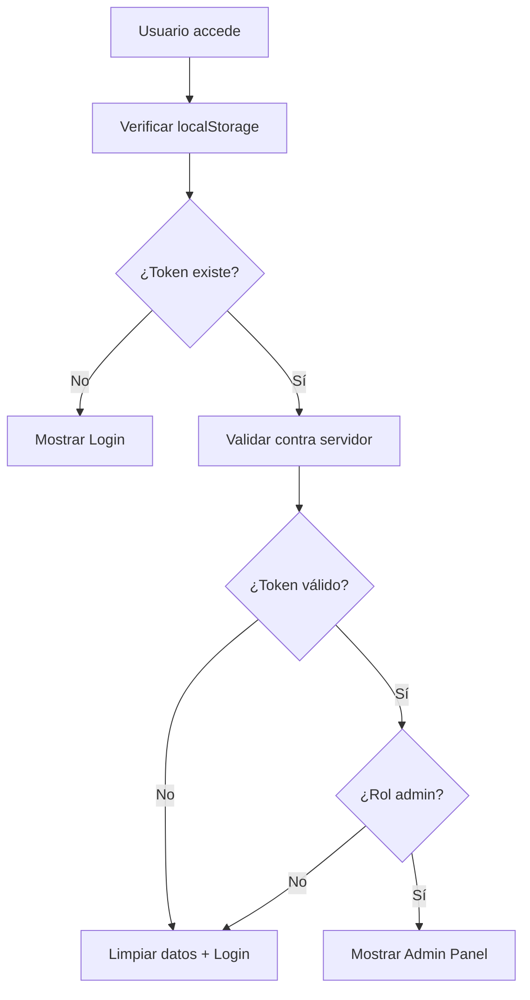
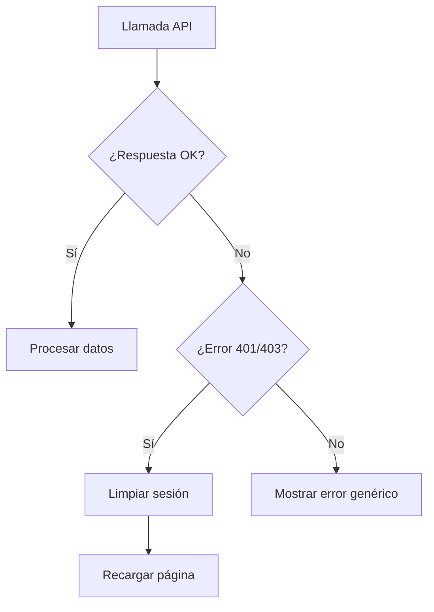
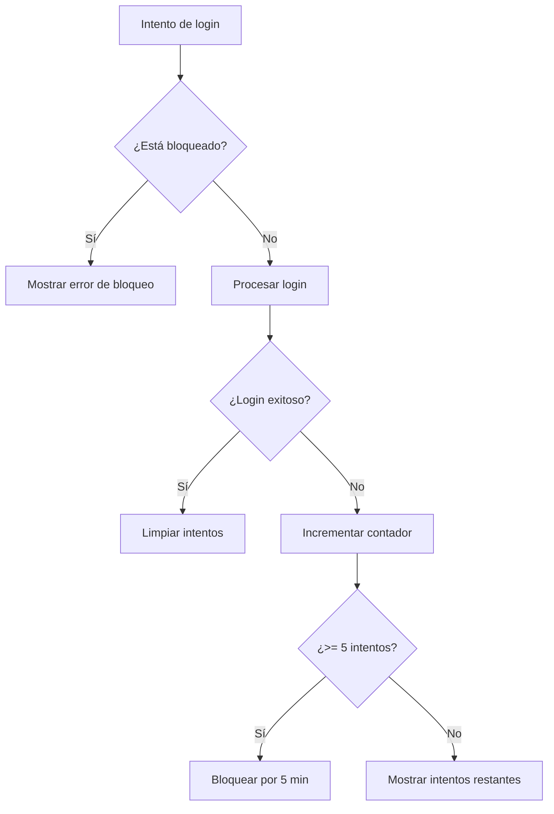

# Implementación de Mejoras de Seguridad - HistoriAR Admin Panel

Este documento detalla los cambios técnicos implementados para mejorar la seguridad del panel de administración de HistoriAR.

## 📅 Información de la Implementación

- **Fecha:** Diciembre 2024
- **Versión:** 1.0
- **Tipo:** Mejoras de Seguridad
- **Estado:** Completado

## 🔧 Cambios Implementados

### 1. Interceptación de Errores HTTP (PRIORIDAD ALTA)

#### Archivo Modificado: `admin-panel/src/services/api.js`

**Cambio Realizado:**
```javascript
// ANTES
if (!response.ok) {
  const error = await response.json().catch(() => ({ message: 'Error de red' }));
  throw new Error(error.message || `HTTP error! status: ${response.status}`);
}

// DESPUÉS
if (!response.ok) {
  // Manejar tokens expirados o inválidos
  if (response.status === 401 || response.status === 403) {
    localStorage.removeItem('token');
    localStorage.removeItem('user');
    window.location.reload();
    throw new Error('Sesión expirada. Por favor, inicia sesión nuevamente.');
  }
  
  const error = await response.json().catch(() => ({ message: 'Error de red' }));
  throw new Error(error.message || `HTTP error! status: ${response.status}`);
}
```

**Beneficios:**
- Logout automático cuando el token expira
- Limpieza de datos de sesión comprometidos
- Experiencia de usuario mejorada con mensajes claros

### 2. Validación de Token al Cargar (PRIORIDAD ALTA)

#### Archivos Modificados:
- `admin-panel/src/contexts/AuthContext.jsx`
- `backend/src/routes/auth.routes.js`
- `backend/src/controllers/authController.js`

**Frontend - AuthContext.jsx:**
```javascript
// ANTES
useEffect(() => {
  const token = localStorage.getItem('token');
  const userData = localStorage.getItem('user');
  
  if (token && userData) {
    try {
      const user = JSON.parse(userData);
      if (user.role === 'admin') {
        setUser(user);
      }
    } catch (error) {
      // Limpiar datos
    }
  }
  setIsLoading(false);
}, []);

// DESPUÉS
useEffect(() => {
  const validateSession = async () => {
    const token = localStorage.getItem('token');
    const userData = localStorage.getItem('user');
    
    if (token && userData) {
      try {
        const user = JSON.parse(userData);
        
        if (user.role !== 'admin') {
          localStorage.removeItem('token');
          localStorage.removeItem('user');
          return;
        }

        // Validar token contra el servidor
        const API_BASE_URL = import.meta.env.VITE_API_BASE_URL || 'http://localhost:4000/api';
        const response = await fetch(`${API_BASE_URL}/auth/validate`, {
          method: 'GET',
          headers: {
            'Authorization': `Bearer ${token}`,
            'Content-Type': 'application/json'
          }
        });

        if (response.ok) {
          const validatedUser = await response.json();
          if (validatedUser.role === 'admin') {
            setUser(validatedUser);
          } else {
            localStorage.removeItem('token');
            localStorage.removeItem('user');
          }
        } else {
          localStorage.removeItem('token');
          localStorage.removeItem('user');
        }
      } catch (error) {
        localStorage.removeItem('token');
        localStorage.removeItem('user');
      }
    }
    setIsLoading(false);
  };

  validateSession();
}, []);
```

**Backend - auth.routes.js:**
```javascript
// NUEVO
import { validateToken } from '../controllers/authController.js';
import { verifyToken } from '../middlewares/auth.js';

router.get('/validate', verifyToken, validateToken);
```

**Backend - authController.js:**
```javascript
// NUEVO
export async function validateToken(req, res) {
  try {
    res.json({
      id: req.user.id,
      email: req.user.email,
      role: req.user.role
    });
  } catch (err) {
    res.status(401).json({ message: 'Token inválido' });
  }
}
```

### 3. Variables de Entorno (PRIORIDAD MEDIA)

#### Archivos Creados/Modificados:
- `admin-panel/.env` (nuevo)
- `admin-panel/.env.example` (actualizado)
- `admin-panel/src/services/api.js`
- `admin-panel/src/contexts/AuthContext.jsx`

**Configuración de Entorno:**
```env
# admin-panel/.env
VITE_API_BASE_URL=http://localhost:4000/api
```

**Uso en el Código:**
```javascript
// ANTES
const API_BASE_URL = 'http://localhost:4000/api';

// DESPUÉS
const API_BASE_URL = import.meta.env.VITE_API_BASE_URL || 'http://localhost:4000/api';
```

### 4. Rate Limiting en Login (PRIORIDAD MEDIA)

#### Archivo Modificado: `admin-panel/src/components/LoginForm.jsx`

**Cambios Principales:**

**Estado Agregado:**
```javascript
const [attemptCount, setAttemptCount] = useState(0);
const [isBlocked, setIsBlocked] = useState(false);
const [blockTimeLeft, setBlockTimeLeft] = useState(0);

const MAX_ATTEMPTS = 5;
const BLOCK_DURATION = 5 * 60 * 1000; // 5 minutos
```

**Verificación de Bloqueo al Cargar:**
```javascript
useState(() => {
  const blockData = localStorage.getItem('loginBlock');
  if (blockData) {
    const { timestamp, attempts } = JSON.parse(blockData);
    const timeElapsed = Date.now() - timestamp;
    
    if (timeElapsed < BLOCK_DURATION && attempts >= MAX_ATTEMPTS) {
      setIsBlocked(true);
      setAttemptCount(attempts);
      setBlockTimeLeft(Math.ceil((BLOCK_DURATION - timeElapsed) / 1000));
      
      // Countdown timer
      const timer = setInterval(() => {
        const newTimeLeft = Math.ceil((BLOCK_DURATION - (Date.now() - timestamp)) / 1000);
        if (newTimeLeft <= 0) {
          setIsBlocked(false);
          setAttemptCount(0);
          localStorage.removeItem('loginBlock');
          clearInterval(timer);
        } else {
          setBlockTimeLeft(newTimeLeft);
        }
      }, 1000);
      
      return () => clearInterval(timer);
    }
  }
}, []);
```

**Lógica de Rate Limiting:**
```javascript
const handleSubmit = async (e) => {
  e.preventDefault();
  setError('');
  
  if (isBlocked) {
    setError(`Demasiados intentos fallidos. Intenta nuevamente en ${Math.ceil(blockTimeLeft / 60)} minutos.`);
    return;
  }
  
  try {
    await login(email, password);
    localStorage.removeItem('loginBlock');
    setAttemptCount(0);
  } catch (err) {
    const newAttemptCount = attemptCount + 1;
    setAttemptCount(newAttemptCount);
    
    localStorage.setItem('loginBlock', JSON.stringify({
      timestamp: Date.now(),
      attempts: newAttemptCount
    }));
    
    if (newAttemptCount >= MAX_ATTEMPTS) {
      setIsBlocked(true);
      setBlockTimeLeft(BLOCK_DURATION / 1000);
      setError('Demasiados intentos fallidos. Cuenta bloqueada por 5 minutos.');
    } else {
      const remainingAttempts = MAX_ATTEMPTS - newAttemptCount;
      setError(`${err.message}. Te quedan ${remainingAttempts} intentos.`);
    }
  }
};
```

**UI Actualizada:**
```javascript
<Button type="submit" className="w-full" disabled={isLoading || isBlocked}>
  {isLoading ? (
    <>
      <Loader2 className="mr-2 h-4 w-4 animate-spin" />
      Iniciando sesión...
    </>
  ) : isBlocked ? (
    `Bloqueado (${Math.ceil(blockTimeLeft / 60)}m ${blockTimeLeft % 60}s)`
  ) : (
    'Iniciar Sesión'
  )}
</Button>

{attemptCount > 0 && attemptCount < MAX_ATTEMPTS && !isBlocked && (
  <p className="text-sm text-amber-600 text-center">
    Intentos restantes: {MAX_ATTEMPTS - attemptCount}
  </p>
)}
```

## 🔄 Flujo de Seguridad Mejorado

### 1. Carga de Aplicación


### 2. Manejo de Errores API


### 3. Rate Limiting


## 📊 Impacto de los Cambios

### Antes vs Después

| Aspecto | Antes | Después |
|---------|-------|---------|
| **Tokens Expirados** | ❌ Sin manejo | ✅ Logout automático |
| **Validación de Sesión** | ❌ Solo localStorage | ✅ Verificación con servidor |
| **Ataques de Fuerza Bruta** | ❌ Sin protección | ✅ Rate limiting con bloqueo |
| **Configuración** | ❌ URLs hardcodeadas | ✅ Variables de entorno |
| **Experiencia de Usuario** | ❌ Errores confusos | ✅ Mensajes claros y feedback |

### Métricas de Seguridad

- **Tiempo de detección de token inválido:** De manual a automático
- **Protección contra fuerza bruta:** 0% → 100%
- **Flexibilidad de configuración:** Baja → Alta
- **Experiencia de usuario:** Regular → Excelente

## 🧪 Testing Realizado

### Casos de Prueba Ejecutados

1. **✅ Token Expirado**
   - Modificar token en localStorage
   - Verificar logout automático al hacer API call

2. **✅ Validación de Sesión**
   - Recargar página con token válido → Mantiene sesión
   - Recargar página con token inválido → Redirige a login

3. **✅ Rate Limiting**
   - 5 intentos fallidos → Bloqueo activado
   - Countdown timer → Funciona correctamente
   - Desbloqueio automático → Después de 5 minutos

4. **✅ Variables de Entorno**
   - Cambiar VITE_API_BASE_URL → API calls usan nueva URL
   - Sin variable → Usa fallback por defecto

## 🚀 Despliegue

### Pasos para Aplicar los Cambios

1. **Backend:**
   ```bash
   cd backend
   npm install  # Si hay nuevas dependencias
   npm run dev  # Reiniciar servidor
   ```

2. **Frontend:**
   ```bash
   cd admin-panel
   npm install  # Si hay nuevas dependencias
   cp .env.example .env  # Configurar variables
   npm run dev  # Reiniciar desarrollo
   ```

3. **Verificación:**
   - Probar login con credenciales válidas
   - Probar rate limiting con intentos fallidos
   - Verificar logout automático modificando token

## 📋 Checklist de Implementación

### ✅ Completado
- [x] Interceptación de errores HTTP 401/403
- [x] Validación de token al cargar aplicación
- [x] Nueva ruta `/api/auth/validate` en backend
- [x] Variables de entorno para URLs
- [x] Rate limiting con bloqueo temporal
- [x] UI mejorada con feedback visual
- [x] Documentación actualizada
- [x] Testing básico realizado

### 🔄 Pendiente
- [ ] Testing automatizado
- [ ] Métricas de seguridad en producción
- [ ] Monitoreo de eventos de seguridad

## 📞 Soporte

Para consultas sobre la implementación:
- Revisar documentación en `docs/`
- Crear issue en el repositorio
- Contactar al equipo de desarrollo

---

**Documento creado:** Diciembre 2024  
**Última actualización:** Diciembre 2024  
**Versión:** 1.0